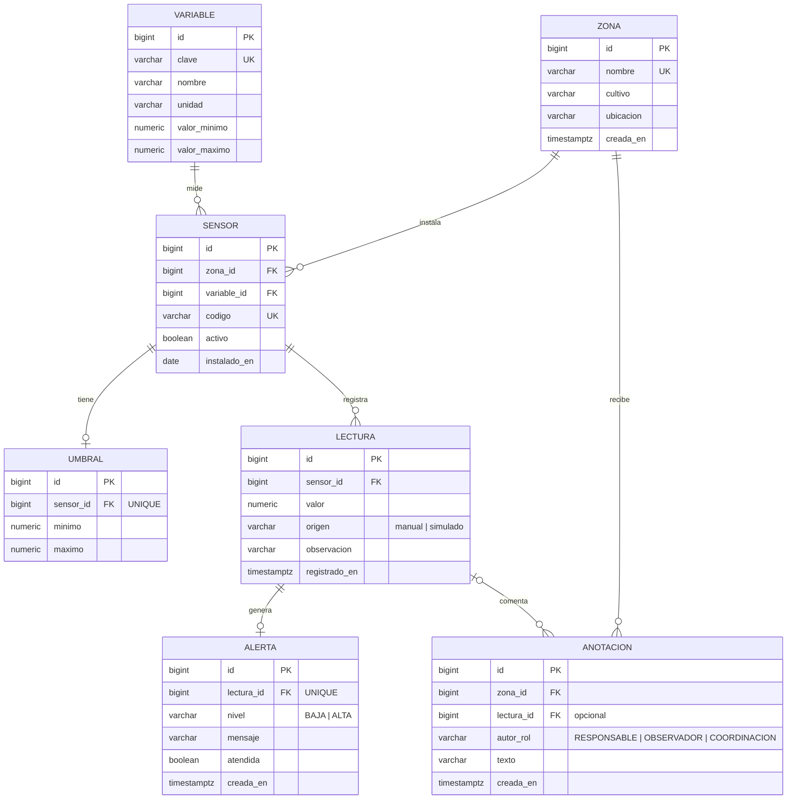

# Modelo de datos - PR09 Monitoreo de huerto o ambiente (7 entidades)

Script de creacion: [`sql/01_schema.sql`](../sql/01_schema.sql). Datos ficticios: [`sql/02_seed.sql`](../sql/02_seed.sql).
Motor: PostgreSQL 16 (compatible con 11+). Entidades de la ficha C11/PR09: **zona, variable, lectura, umbral, alerta,
anotacion**. Extension justificada: **sensor** (dispositivo que mide una variable en una zona; en Web 4.0 sera la fuente
IoT simulada, que la ficha exige identificar por dispositivo, instante, variable, unidad y valor). Total: 7 entidades,
dentro del limite "entre cinco y siete".

## Diagrama entidad-relacion

## Diccionario de entidades

| # | Entidad | RF | Proposito | Reglas de integridad (RNF04) |
|---|---|---|---|---|
| 1 | `zona` | RF01 | Cama, invernadero o parcela del huerto. | `nombre` unico; `ubicacion` obligatoria. |
| 2 | `variable` | RF02 | Magnitud ambiental con unidad y **rango fisico** valido. | `clave` unica; `CHECK (valor_minimo < valor_maximo)`. |
| 3 | `sensor` | extension | Dispositivo (fisico o simulado) que mide una variable en una zona. | FK a `zona` y `variable`; `codigo` unico; `activo`. |
| 4 | `umbral` | RF04 | **Rango operativo** deseado por sensor; fuera de el se genera alerta. | Uno por sensor (`sensor_id` unico); `CHECK (minimo < maximo)`. |
| 5 | `lectura` | RF03, RF05 | Medicion con instante (`registrado_en`), valor y **procedencia**. | FK a `sensor`; `CHECK origen IN ('manual','simulado')`; indice por sensor y fecha. |
| 6 | `alerta` | RF06 | Aviso creado automaticamente al registrar una lectura fuera del umbral. | Una por lectura (`lectura_id` unico); `CHECK nivel IN ('BAJA','ALTA')`. |
| 7 | `anotacion` | RF06 | Nota de uno de los tres roles funcionales sobre una zona, opcionalmente ligada a una lectura. | FK a `zona` (cascada) y `lectura` (SET NULL); `CHECK autor_rol IN (3 roles)`; `CHECK length(texto) >= 3`. |

## Por que dos rangos (rango fisico vs. umbral)

- El **rango fisico** (`variable`) sirve para *rechazar* entradas imposibles (150 C en temperatura ambiente):
  validacion negativa, responde 400 y no persiste (CA02).
- El **umbral** (`umbral`, por sensor) sirve para *aceptar* la lectura pero *avisar*: 38 C es posible, se guarda, y como
  excede el maximo operativo de 32 C se crea una alerta ALTA (CA01).

## Control del riesgo principal de la ficha

"Presentar simulacion como medicion real": la columna `lectura.origen` etiqueta cada fila como `manual` (capturada por
el observador) o `simulado` (semilla o, en Web 4.0, el simulador). La interfaz muestra la etiqueta y la unidad junto al
valor; el `CHECK` impide valores fuera de esas dos procedencias.

## Datos ficticios de la semilla

| Sensor | Variable (unidad) | Zona | Rango fisico | Umbral |
|---|---|---|---|---|
| `SEN-A-TEMP-01` | Temperatura ambiente (C) | Cama A (jitomate) | [-10, 60] | [15, 32] |
| `SEN-A-HSUE-01` | Humedad de suelo (%) | Cama A | [0, 100] | [40, 80] |
| `SEN-I1-TEMP-01` | Temperatura ambiente (C) | Invernadero 1 (lechuga) | [-10, 60] | [18, 30] |
| `SEN-I1-HAIR-01` | Humedad relativa (%) | Invernadero 1 | [0, 100] | [50, 85] |
| `SEN-I1-LUZ-01` | Luminosidad (lux) | Invernadero 1 | [0, 100000] | [2000, 60000] |

Lecturas iniciales (`origen = simulado`): 24.50 C y 55.00 %, ambas en rango. Una anotacion inicial del rol RESPONSABLE.

## Operaciones del incremento sobre el modelo

| Operacion | SQL (parametrizado) | Clase |
|---|---|---|
| Listar sensores activos con zona, variable y umbral | `SELECT ... FROM sensor JOIN zona JOIN variable LEFT JOIN umbral WHERE s.activo = TRUE` | `SensorRepository.findActivos` |
| Buscar sensor por id (en la transaccion) | `... WHERE s.id = ?` | `SensorRepository.findById` |
| Insertar lectura | `INSERT INTO lectura (sensor_id, valor, origen, observacion) VALUES (?, ?, 'manual', ?) RETURNING id` | `LecturaRepository.insertLectura` |
| Insertar alerta | `INSERT INTO alerta (lectura_id, nivel, mensaje) VALUES (?, ?, ?) RETURNING id` | `LecturaRepository.insertAlerta` |
| Historial de lecturas con alerta | `SELECT ... FROM lectura ... LEFT JOIN alerta ... ORDER BY registrado_en DESC LIMIT ?` | `LecturaRepository.findRecientes` |
| Listar alertas | `SELECT ... FROM alerta JOIN lectura JOIN sensor JOIN variable JOIN zona ... LIMIT ?` | `LecturaRepository.findAlertas` |
| Listar zonas | `SELECT id, nombre, cultivo, ubicacion FROM zona ORDER BY nombre` | `AnotacionRepository.findZonas` |
| Insertar anotacion | `INSERT INTO anotacion (zona_id, lectura_id, autor_rol, texto) VALUES (?, ?, ?, ?) RETURNING id` | `AnotacionRepository.insert` |
| Listar anotaciones | `SELECT ... FROM anotacion JOIN zona ... ORDER BY creada_en DESC LIMIT ?` | `AnotacionRepository.findRecientes` |
| Salud | `SELECT version(), (SELECT count(*) FROM lectura)` | `HealthServlet` |
