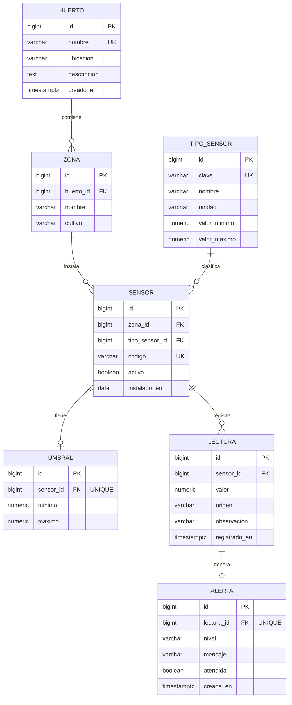

# Modelo de datos - PRxx Monitoreo de huerto (7 entidades)

Script de creacion: [`sql/01_schema.sql`](../sql/01_schema.sql). Datos ficticios: [`sql/02_seed.sql`](../sql/02_seed.sql).
Motor: PostgreSQL 16 (compatible con 11+: identidad `GENERATED ALWAYS AS IDENTITY`, `TIMESTAMPTZ`, `CHECK`).

## Diagrama entidad-relacion

## Diccionario de entidades

| # | Entidad | Proposito | Reglas de integridad |
|---|---|---|---|
| 1 | `huerto` | Sitio fisico o ambiente controlado que se monitorea. | `nombre` unico. |
| 2 | `zona` | Subdivision del huerto (cama, invernadero). | FK a `huerto` con borrado en cascada; `(huerto_id, nombre)` unico. |
| 3 | `tipo_sensor` | Catalogo de magnitudes y su **rango fisico** valido (limite de lo que una lectura puede valer). | `clave` unica; `valor_minimo < valor_maximo`. |
| 4 | `sensor` | Dispositivo instalado en una zona, de un tipo. | FK a `zona` y `tipo_sensor`; `codigo` unico; `activo` controla si admite lecturas. |
| 5 | `umbral` | **Rango operativo** deseado para un sensor; fuera de el se genera alerta. | Uno por sensor (`sensor_id` unico); `minimo < maximo`. |
| 6 | `lectura` | Medicion registrada por el operador (`manual`) o por un simulador (`simulado`). Entidad del flujo principal. | FK a `sensor`; `origen IN ('manual','simulado')`; indice por sensor y fecha. |
| 7 | `alerta` | Aviso creado automaticamente al registrar una lectura fuera del umbral. | Una por lectura (`lectura_id` unico); `nivel IN ('BAJA','ALTA')`. |

## Por que dos rangos (rango fisico vs. umbral)

- El **rango fisico** vive en `tipo_sensor` y sirve para *rechazar* entradas imposibles (150 C en un sensor de
  temperatura ambiente). Es una validacion negativa: responde 400 y no persiste.
- El **umbral** vive en `umbral` (por sensor) y sirve para *aceptar* la lectura pero *avisar*: 38 C es fisicamente
  posible, se guarda, y como excede el maximo operativo de 32 C se crea una alerta ALTA.

Esta separacion permite demostrar en P02 tanto una validacion negativa (RF-03) como una regla de negocio
positiva con efecto secundario persistido (RF-05) sin ampliar el alcance del incremento.

## Datos ficticios de la semilla

| Sensor | Tipo | Zona | Rango fisico | Umbral |
|---|---|---|---|---|
| `SEN-A-TEMP-01` | Temperatura ambiente (C) | Cama A | [-10, 60] | [15, 32] |
| `SEN-A-HSUE-01` | Humedad de suelo (%) | Cama A | [0, 100] | [40, 80] |
| `SEN-I1-TEMP-01` | Temperatura ambiente (C) | Invernadero 1 | [-10, 60] | [18, 30] |
| `SEN-I1-HAIR-01` | Humedad relativa (%) | Invernadero 1 | [0, 100] | [50, 85] |
| `SEN-I1-LUZ-01` | Luminosidad (lux) | Invernadero 1 | [0, 100000] | [2000, 60000] |

Lecturas iniciales (`origen = simulado`): `SEN-A-TEMP-01` = 24.50 C y `SEN-A-HSUE-01` = 55.00 %, ambas en rango.

## Operaciones del incremento sobre el modelo

| Operacion | SQL (parametrizado) | Clase |
|---|---|---|
| Listar sensores activos con tipo, zona, huerto y umbral | `SELECT ... FROM sensor JOIN zona JOIN huerto JOIN tipo_sensor LEFT JOIN umbral WHERE s.activo = TRUE` | `SensorRepository.findActivos` |
| Buscar sensor por id (dentro de la transaccion) | `... WHERE s.id = ?` | `SensorRepository.findById` |
| Insertar lectura | `INSERT INTO lectura (sensor_id, valor, origen, observacion) VALUES (?, ?, 'manual', ?) RETURNING id` | `LecturaRepository.insertLectura` |
| Insertar alerta | `INSERT INTO alerta (lectura_id, nivel, mensaje) VALUES (?, ?, ?) RETURNING id` | `LecturaRepository.insertAlerta` |
| Listar lecturas recientes con alerta | `SELECT ... FROM lectura ... LEFT JOIN alerta ... ORDER BY registrado_en DESC LIMIT ?` | `LecturaRepository.findRecientes` |
| Listar alertas | `SELECT ... FROM alerta JOIN lectura JOIN sensor ... LIMIT ?` | `LecturaRepository.findAlertas` |
| Salud | `SELECT version(), (SELECT count(*) FROM lectura)` | `HealthServlet` |
